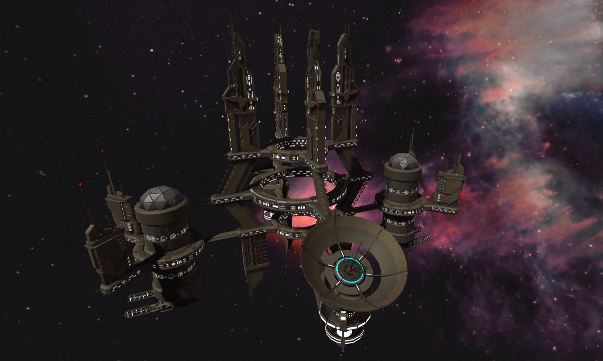

# 💰 Daily Mining

Warships can **earn ORFL** from various places when there are no combats and battles. Players just need to put them in the right position and the warship will automatically start working.

Different places require different warships to work. The higher the warship level and attribute, the more ORFL players can earn.

ORFL is the currency in this game, come and earn it!

### Interstellar Base Camp

The Interstellar base camp is the largest immovable base camp among the stars, holding hundreds of thousands of people. Countless warships enter and leave frequently every day, and they also have strong defense capabilities.

In the most basic workplace, all warships can participate.

There are no role and level requirements.

Remuneration per block: 0.005 ORFL

### Space Fortress

The Space fortress is the Starfleet's stronghold in planetary warfare, the size of 1/5 Interstellar base camp, can move slowly with the fleet, and has its own super firepower.

Role requirements:Interstellar Cruise Ship, Interstellar Titan Ship

Level requirements: 2

Compensation per block:&#x20;

$$
0.008 + (sum of 6 attributes-200)/200* 0.008  ORFL
$$

 (1).png>)

### Interstellar Space Station

An important transit station in StarCraft, used for hoarding troops, warship maintenance, and refueling.

Role requirements:Interstellar Destroyer, Interstellar Missile Ship

Level requirements: 2

Compensation per block:&#x20;

$$
0.006 + (sum of 6 attributes-200)/200*0.006 ORFL
$$

 (1).png>)

### Orbital Space Station

The space station closest to the planet is mainly used for the defense of the near orbit of the planet, carrying beam energy weapons that frighten the enemy.

Role requirements:Interstellar Frigate, Interstellar Belligerence Ship

Level requirements: 2

Compensation per block:&#x20;

$$
0.005 + (sum of 6 attributes-200)/200* 0.005 ORFL
$$

### Cosmic Port

In the busiest interstellar port, millions of troops enter and leave every day.

Role requirements:Interstellar Transport Ship, Interstellar Reconnaissance Ship

Level requirements: 2

Compensation per block:&#x20;

$$
0.005 + (sum of 6 attributes-200)/200*0.005 ORFL
$$

 (1).png>)

**Warships can only get reward once every 24 hours.**
