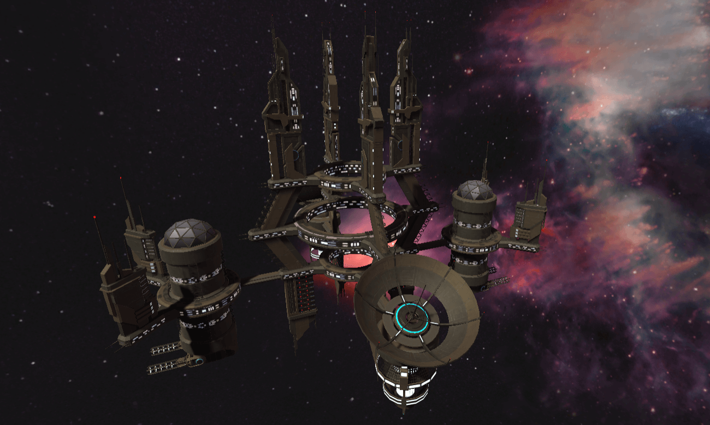
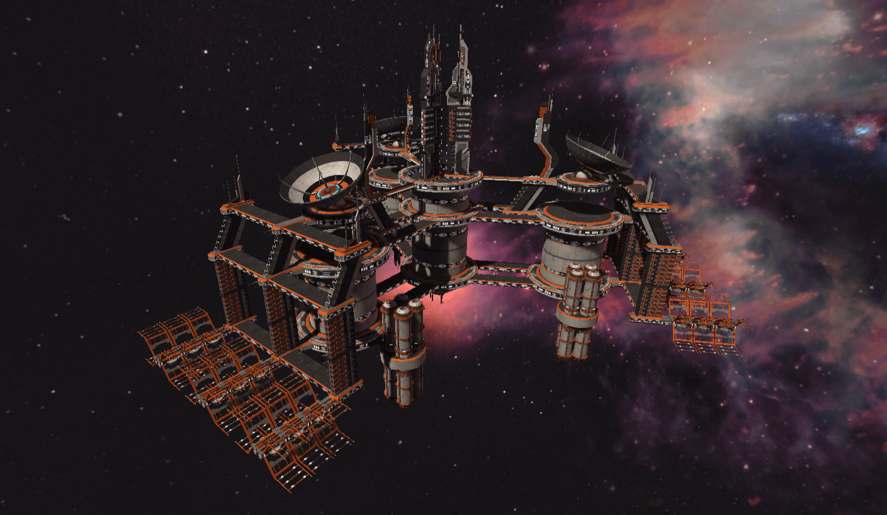

# 💰 日常挖矿

星际战舰在没有PVE或PVP战斗的时候，他们可以在各个星际空间站**赚取ORFL**。玩家只需将它们放在正确的位置，战舰就会自动开始工作。

不同的场所要求不同的战舰工作。战舰级别和属性越高，玩家可以赚取的ORFL就越多。

ORFL是游戏中的货币，快来赚取吧！

### **空间堡垒**

空间堡垒是星际中最大的不可移动的堡垒，可容纳数十万人。无数战舰每日频繁进出其中，其自身也拥有强大的防御能力。

最基础的工作场所，所有战舰都可以参与。

没有角色和等级要求。

每区块工作报酬：0.005 ORFL

### **星际要塞**&#x20;

星际中重要的中转站，用来囤积兵力，战舰维修，燃料补给。

角色要求：星际巡航母舰、星际泰坦战舰

等级要求: 2

每区块工作报酬：

$$
0.008+(6种属性之和-200/200)*0.008 ORFL
$$

 (1).png>)

### **星际空间站**

星际要塞是星际舰队在星球作战中的大本营，有五分之一个空间堡垒的大小，可以随着舰队缓慢移动，其自身也有超强的火力。

角色要求：星际驱逐舰、星际导弹舰

等级要求: 2

每区块工作报酬：

$$
0.006+(6种属性之和-200/200)*0.006 ORFL
$$

 (1).png>)

### **轨道太空站**&#x20;

离行星最近的太空站，主要用于星球近轨防卫，搭载的束能武器让敌人闻风丧胆。

角色要求：星际护卫舰、星际战列舰

等级要求: 2

每区块工作报酬：

$$
0.005+(6种属性之和-200/200)*0.005 ORFL
$$

 (1).png>)

### **宇宙港**

最繁忙的星际港口，每日进出的兵力物资数以百万计。

角色要求：星际运输舰、星际侦查舰

等级要求: 2

每区块工作报酬：

$$
0.005+(6种属性之和-200/200)*0.005 ORFL
$$

**战舰每24小时内只能领取一次奖励。**
