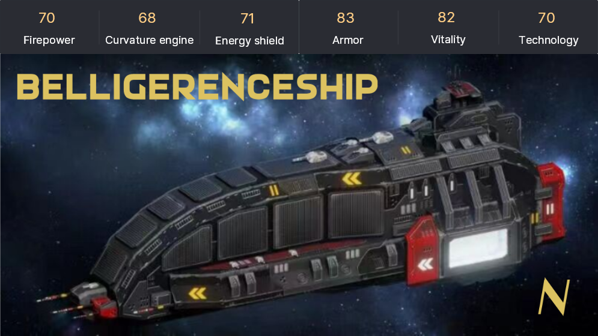
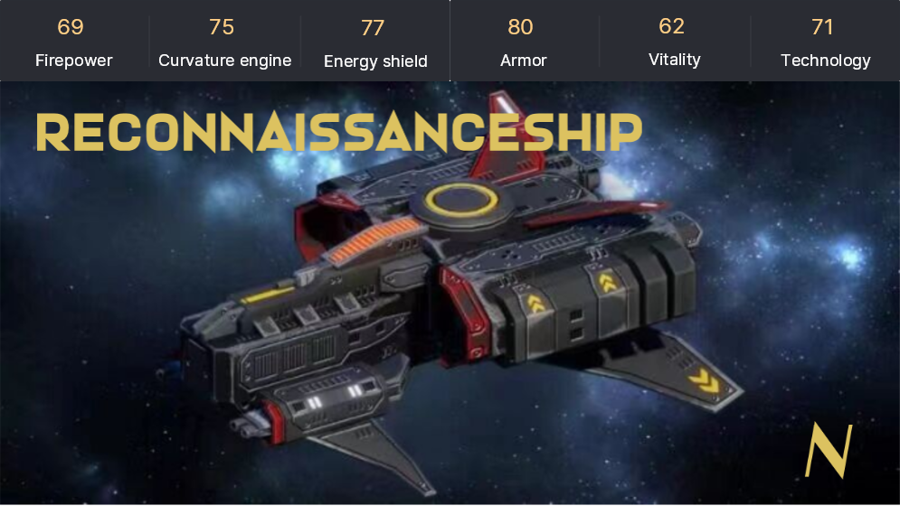
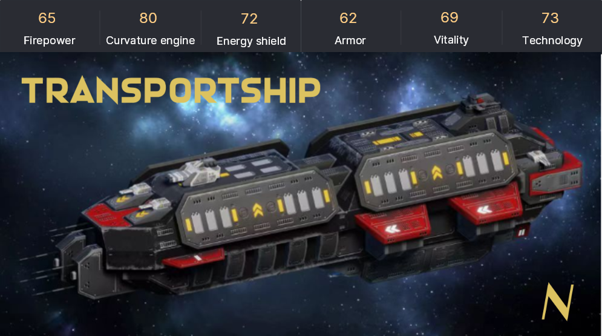

# 🛸 角色

玩家创建角色将会随机获得一艘战舰，**目前共有8种战舰**。未来随着游戏更新会提供更多的战舰类型。

### **星际巡航母舰**

稀有度：SS（2%）

伤害：物理攻击

优势：火力&#x20;

劣势：能量护盾

星际巡航母舰是舰队的指挥中心。装载着重型装甲和能量护盾的航母可以释放众多星际拦截机而强行突破敌人的防御，星际拦截机可以在母舰的整体控制下，对超大范围内的敌对目标实施搜索、追踪、锁定和攻击，能够全方位地炮火打击任何角度的敌舰。舰体本身还能够使用反物质重型火炮无情地歼灭对手。

.png>)

### **星际泰坦战舰**

稀有度：SS（2%）

伤害类型：能量攻击

优势：科技&#x20;

劣势：装甲

星际泰坦战舰拥有“天堂猛兽”、“阳光杀手”的称号，绝对是星际舰队战斗力的巅峰，真正能做到大范围、高强度、长时间的连续战斗，他搭载的定向能武器威力当于原子弹100万倍，可以迅速击碎一颗小行星，所蕴含的恐怖能量攻击足以毁灭一切威胁，长期作为舰队的主力战舰参与各种严酷战斗。

### **星际驱逐舰**

稀有度：S（6%）

伤害类型：能量攻击&#x20;

优势：科技&#x20;

劣势：曲率引擎

星际驱逐舰装备有粒子束武器，是舰队作战的中坚力量，性能跟反应敏捷的护卫舰恰好相反，星际驱逐舰牺牲了其灵活的机动性，用来提升本身装甲厚度，舰身坚固、火力出众的它，通常在战场之上皆有不俗的表现。具有综合作战能力强、续航力大、适航性能好、生存能力强以及用途多等显著特点。

.png>)

### **星际导弹舰**&#x20;

稀有度：S（6%）

伤害类型：物理攻击&#x20;

优势：火力&#x20;

劣势：科技

星际导弹舰广泛作为星际舰队的核心战舰出现，专门用来打击毁灭太空防御建筑，一举冲垮对方的舰队阵型。威力恐怖的多种暗物质导弹，可以一次性摧毁空间站、宇宙港，引爆小行星，远距离摧毁敌人从而获得胜利。不过自身缓慢而笨重，需要其他兵力协同执行任务。

.png>)

### **星际护卫舰**

稀有度：N（21%）

伤害类型：物理攻击

优势：装甲

劣势：能量护盾

星际护卫舰主要是为星际舰队担任护航、巡逻、警戒等作战任务，属于中小型战舰，以其机动灵活性著称，飞行速度快，反应敏捷，搭配凶猛的近距离火炮，将来犯者消灭于无形。星际护卫舰是星际舰队中最小型的战斗战舰，除了护航以外常被派执行巡逻危险区域的任务。

.png>)

### **星际战列舰**

稀有度：N（21%）

伤害类型：能量攻击

优势：能量护盾&#x20;

劣势：火力

星际战列舰作为舰队主力之一，主要用于攻击敌方主力战舰，其搭载的重型激光炮，能直接穿透敌方装甲，在近距离作战中有着无与伦比的杀伤力。被人们誉为“星战多面手”。星际战列舰配备十米厚的外部装甲，能抵抗一定程度的密集炮火打击，反击能力也表现得不俗，属于强大的多功能战舰。

### **星际侦查舰**

稀有度：N（21%）

伤害类型： 物理攻击

优势：曲率引擎&#x20;

劣势：生命力

星际侦查舰作用是探测敌方位置，抵近敌方舰队，通过高科技手段截取对方传送的信号情报，了解其军事动向，牵制敌方。其超高的科技能力，同样能阻断敌方战舰的空间跃迁行为，使得限制范围内的敌人无法安然逃脱。其战舰火力或许不足为惧，但是战略意义没人敢忽视。

### **星际运输舰**&#x20;

稀有度：N（21%）

伤害类型：能量攻击

优势：生命力&#x20;

劣势：装甲

星际运输舰是用于向前线运送人员、武器装备和军需物资的勤务战舰，装备有防御性的等离子火炮，拥有高机动性高续航能力的特点。其战略地位显著，时常与护卫舰协同完成运输任务。同时因为其自身优势，在资源采集运输方面也是绝对主力。

