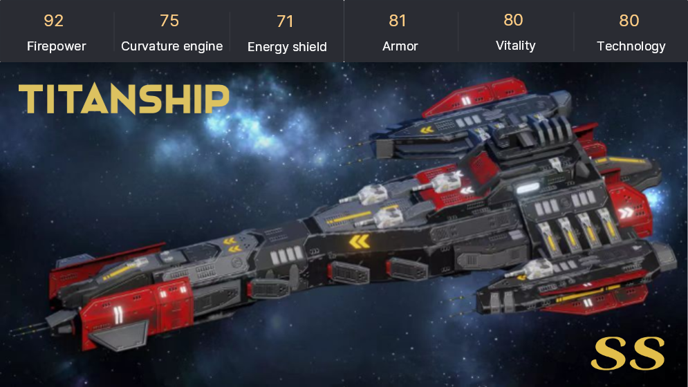

# 🛸 Role

Players who create characters will randomly get a battleship. There are currently **8 types of warships**. More types of battleships will be available as the game is updated in the future.

### Interstellar Cruise Ship

Rarity: SS (2%)

Damage: Physical attack

Advantage: Power

Disadvantage: Curvature engine

The Interstellar Cruise Ship is the command center of the fleet. An aircraft carrier equipped with heavy armor and energy shields can release a large number of interstellar interceptors and forcibly break through the enemy's defenses. Interstellar interceptors can be under the overall control of the mother ship to search, track, lock and attack hostile targets over a wide range, and can fire enemy ships at any angle in all directions. The ship itself can also use antimatter heavy artillery to mercilessly wipe out opponents.

.png>)

### Interstellar Titan Ship

Rarity: SS (2%)

Damage: Physical attack

Advantage: Technology

Disadvantage: Armour

The Interstellar Titan Ship has the title of "Beast of Heaven" and "Sunshine Killer". It is absolutely the pinnacle of Starfleet's combat effectiveness, and can really achieve large-scale, high-intensity, long-term continuous battles. the directed energy weapon he carries is 1 million times as powerful as an atomic bomb and can quickly smash an asteroid, and the terrorist energy contained in the attack is enough to destroy all threats, and has been participating in various harsh battles as the main warship of the fleet for a long time.

### Interstellar Destroyer Ship

Rarity: S (6%)

Damage: Energy attack

Advantage: Armour

Disadvantage: Curvature engine

Equipped with particle beam weapons, the Interstellar Destroyer Ship is the backbone of the fleet, and its performance is contrary to that of the responsive frigate. The interstellar destroyer sacrifices its flexible maneuverability to increase the thickness of its armor. with its strong hull and excellent firepower, it usually performs well on the battlefield. It has the remarkable characteristics of strong comprehensive combat capability, large endurance, good airworthiness, strong survivability and many uses.

### Interstellar Missile Ship

Rarity: S (6%)

Damage: Physical attack

Advantage: Power

Disadvantage: Curvature engine

Interstellar Missile Ships have widely appeared as the core warships of the Starfleet, which are specially used to destroy space defense buildings and destroy each other's fleet formation in one fell swoop. A variety of powerful and terrifying dark matter missiles can destroy the space station and cosmic port at once, detonate asteroids, and destroy the enemy from a long distance to win victory. However, it is slow and bulky, and other forces are needed to cooperate in carrying out the task.

.png>)

### Interstellar Frigate Ship

Rarity: N (21%)

Damage: Physical attack

Advantage: Curvature engine

Disadvantage: Energy shield

The Interstellar Frigate Ship is mainly engaged in escort, patrol, vigilance and other combat tasks for the Starfleet, belonging to small and medium-sized warships, famous for its mobility and flexibility, fast flight speed, quick response, and ferocious close-range artillery. Future criminals will be wiped out in the invisible. The Starfrigate is the smallest battleship in the Starfleet and is often assigned to patrol dangerous areas in addition to escorts.

### Interstellar Battleship

Rarity: N (21%)

Damage: Energy attack

Advantage: Armour

Disadvantage: Power

As one of the main forces of the fleet, interstellar battleships are mainly used to attack enemy warships. The heavy laser guns carried by them can directly penetrate enemy armor and have unparalleled lethality in close combat. It is praised as "Star Wars generalist". The Star Battleship is equipped with 10 meters thick external armor, which can withstand a certain degree of intensive gunfire, and its counterattack ability is good, so it belongs to a powerful multi-purpose battleship.

### Interstellar Reconnaissance Ship

Rarity: N (21%)

Damage: Physical attack

Advantage: Technology

Disadvantage: Power

The function of the interstellar reconnaissance ship is to detect the enemy's position, approach the enemy's fleet, intercept the signals and intelligence transmitted by the other party through high-tech means, understand its military movements, and contain the enemy. Its ultra-high scientific and technological capabilities can also block the space transition behavior of enemy warships, making it impossible for the enemy within the limits to escape safely. Its battleship firepower may not be feared, but no one dares to ignore its strategic significance.

### Interstellar Transport Ship

Rarity: N (21%)

Damage: Energy attack

Advantage: Vitality

Disadvantage: Armour

Interstellar Transport Ship is a service warship used to transport personnel, weapons and supplies to the front, equipped with defensive plasma artillery, with the characteristics of high mobility and high endurance. It has a prominent strategic position and often cooperates with frigates to complete transport tasks. At the same time, because of its own advantages, it is also the absolute main force in resource collection and transportation.

